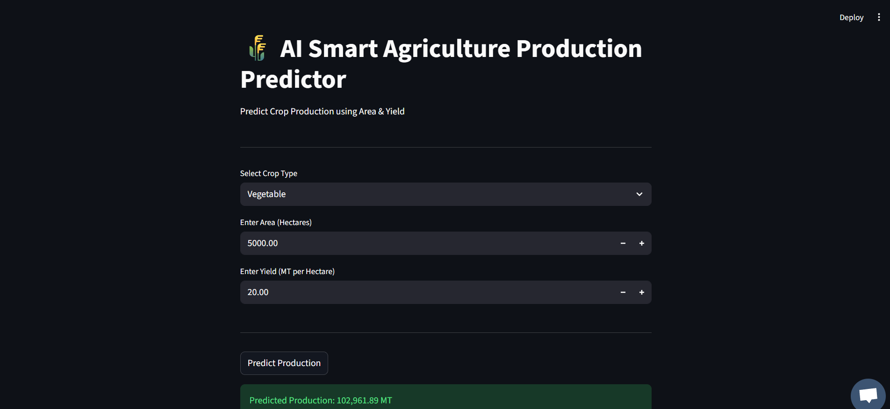

# 🌾 AI Smart Agriculture Production Predictor

An AI-powered agricultural analytics system that predicts crop production using Machine Learning (Random Forest Regressor).
https://github.com/Bhaskar-06/AGRI-APP?tab=readme-ov-file
---

## 📌 Project Overview

This project uses district-level agricultural datasets to predict total crop production based on:

- Area (Hectares)
- Yield (MT per Hectare)
- Crop Type (Vegetable / Fruit)

---

## 🎯 Problem Statement

Accurate crop production prediction helps:
- Farmers optimize cultivation decisions
- Policymakers estimate supply
- Agricultural planners improve forecasting

---

## 🧠 Machine Learning Model

Model Used: Random Forest Regressor

---
---

## 📊 Model Performance

- Model Used: Random Forest Regressor
- R² Score: 0.9678
- Mean Absolute Error (MAE): 42,552 MT

The model demonstrates strong predictive performance for district-level crop production.

## 📊 Dataset

District-level crop dataset containing:
- Area
- Yield
- Production

---
---

## 🏗 System Architecture

### 1️⃣ Data Layer
- District-level agricultural dataset (CSV)
- Features: Area, Yield, Crop Type
- Target: Production (MT)

### 2️⃣ Model Training Layer
- Data Cleaning using Pandas
- Train-Test Split (80/20)
- Model: Random Forest Regressor
- Model saved as: `crop_model.pkl`

### 3️⃣ Application Layer
- Streamlit Web Interface
- User inputs:
  - Area (Hectares)
  - Yield (MT per Hectare)
  - Crop Type (Vegetable / Fruit)

### 4️⃣ Prediction Flow

User Input  
⬇  
Feature Processing (Pandas)  
⬇  
Trained ML Model  
⬇  
Production Prediction  
⬇  
Result Displayed in UI

---

## 🚀 How to Run

1. Clone repository
2. Create virtual environment
3. Install requirements
4. Run:

streamlit run src/app.py

---
---

## 🖥 Application Demo

---
---

## 📁 Project Structure

AI-Smart-Agriculture-PBL-2026/
│
├── data/
├── models/
│   └── crop_model.pkl
├── src/
│   └── app.py
├── requirements.txt
├── README.md
├── LICENSE
---
---
## 👨‍💻 Author

Bhaskar B  
G A Srujan Gouda

PBL-2
